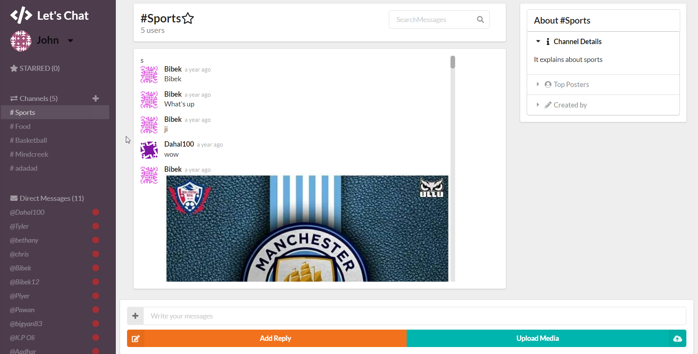

# About App

Using this Application ,people can chat in person or in group.It is basically the clone of slack
 
# Technology Used

Language:React, \
Framework:Node.js \
Database:Firebase

# Homepage
 

# AppImages
  

